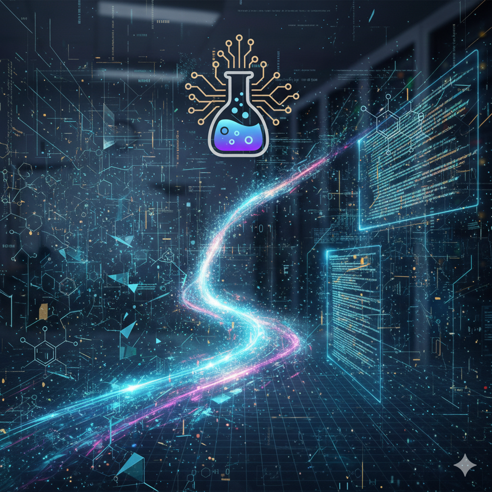

# Hi, I’m Godfred

## Summary
I’m a Chemistry PhD and college professor with a strong interest in building and applying software tools to scientific, educational, and data-driven problems. I develop web applications using **React**, implement backend logic with **Java**, and work with **SQL** and data workflows. My work often sits at the intersection of education, science, and technology, with an emphasis on clarity, usability, and real-world impact.

## Focus
I am particularly interested in:
- Designing and building well-structured software projects  
- Learning and applying modern development workflows  
- Creating tools that support learning, analysis, and problem solving  

## Explore
- [Projects](projects)
- [Resume & Achievements](resume)
- [Contact](contact)

