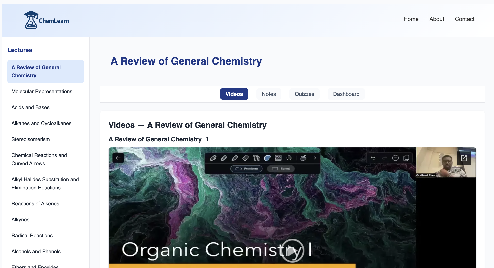

# Project Work

## ChemLearn
**ChemLearn** is a modern learning platform designed to support students studying Organic Chemistry. The application brings together instructional content, interactive features, and a structured user experience to reinforce learning outside the classroom.

### Key Features
- Modular lecture and content organization  
- Interactive quizzes and learning checkpoints  
- Student-focused dashboard for navigating course materials  

### Project Links
- <a href="https://github.com/gfianu/SWD-U1-Project_Godfred-F" target="_blank" rel="noopener noreferrer">GitHub Repository</a>  
- <a href="https://swdu1chemlearn.netlify.app/" target="_blank" rel="noopener noreferrer">Live Demo</a>

