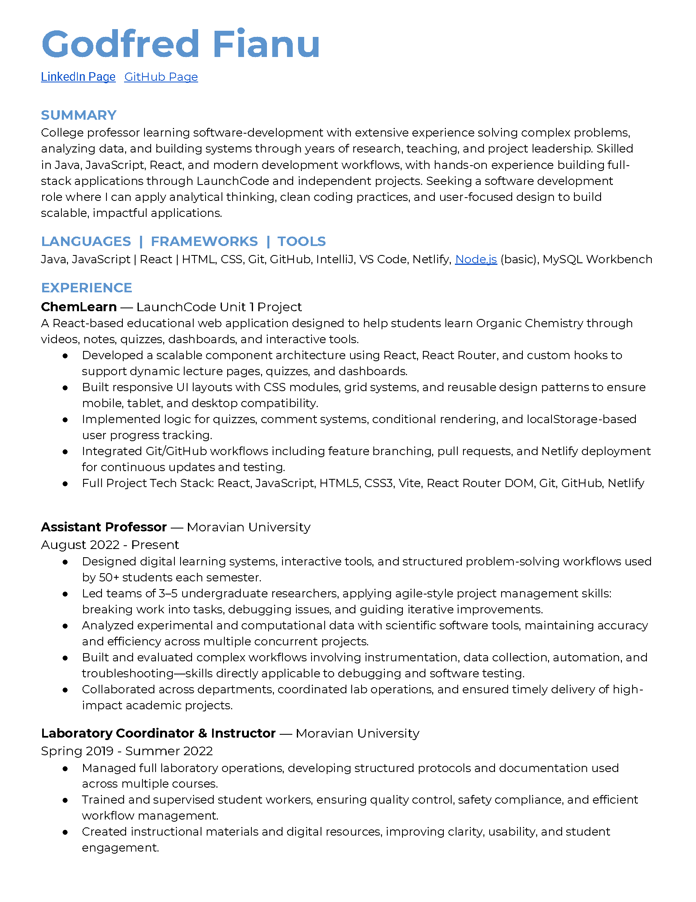

# Resume

<strong>Download:</strong>
<a href="assets/SWD_Resume- 2026_Godfred_F.pdf"
   target="_blank"
   rel="noopener noreferrer">
  Resume (PDF)
</a>

## Preview

## Achievements (MVP)
- Built: ChemLearn (React-based chemistry learning app) <a href="https://swdu1chemlearn.netlify.app/" target="_blank" rel="noopener noreferrer">Live Demo</a>
- Teaching/Leadership: Assistant Professor, course design + mentorship
- Research: Catalysis / organic synthesis + data analysis experience

